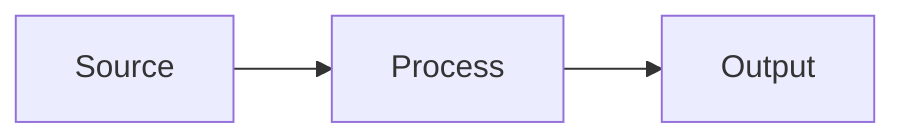

# <Topic>

One-paragraph orientation: what this file covers, why it exists, who cares.

## <Section 1>

Prose explaining the first concept. Concrete. Names real files and functions. Cite source locations as `path/to/file.ext:line` so the reader can jump.

## <Section 2>

More prose. Keep to one topic per file. If you're tempted to add a section about an unrelated concern — that's a new leaf, not a new section here.

## References

- Source: `path/to/real/file.ext`
- Related: [<other-leaf>](../<other-area>/<other-leaf>.md)

<!-- No hard size limit. But if you're covering multiple independent topics, split. -->
